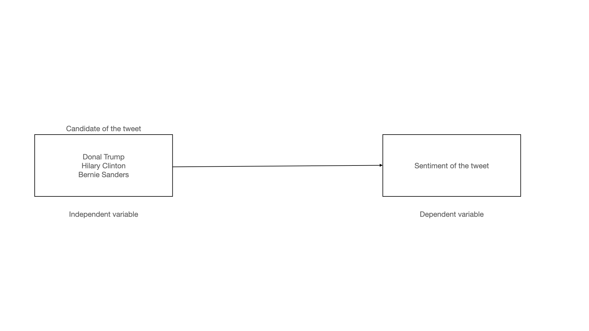
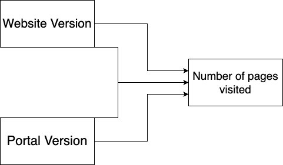

```{r setup, include=FALSE}
knitr::opts_chunk$set(echo = TRUE)
```


\tableofcontents

# Part 1 - Design and set-up of true experiment 

## The motivation for the planned research 
(Max 200 words)
Previous research [1] has shown that while some technologies can improve student achievement, others may actually decrease it. The impact of technology is very dependent on the technology itself but also on who is using it, teachers or students. Given that ChatGPT is a widely-used innovation among students, it is important to investigate its effect on student achievement. By comparing the learning outcomes, intrinsic motivation, and perceived difficulty of students who have access to ChatGPT with those who rely on traditional coding resources, the research aims to determine if ChatGPT can improve student achievement in a challenging coding assignment.

1. New global data reveal education technology’s impact on learning. (2020, June 12). McKinsey & Company. https://www.mckinsey.com/industries/education/our-insights/new-global-data-reveal-education-technologys-impact-on-learning#/
2.Lancaster, Thomas & wilkinson, richard. (2014). Improving Student Motivation Using Technology Within The STEM Disciplines. 

## The theory underlying the research  
(Max 200 words) Preferable based on theories reported in literature
The main theory which encompasses this topic is within the field of educational technologies. According to a paper by Francis et al. discusses the effects of technology on student motivation and engagement in classroom-based learning. The study found that students feel motivated through the specific use of technology in the classroom, whether it be for educational purposes or for accommodation in the classroom. This suggests that as technology continues to advance, there is potential for even greater impact on student motivation and engagement in the classroom. The integration of technology into education can help teachers differentiate instruction, motivate students, and include all skill levels. However, some studies also indicate that the extensive use of internet resources can reduce the difficulty level of college assignments and thus reduce student motivation, as outlined in a study conducted at Swansea university. Furthermore, the study conducted at Swansea University highlighted that excessive reliance on internet resources for assignments can potentially undermine students' motivation by diminishing the perceived challenge and authenticity of the tasks. Therefore, it is important to strike a balance in usingutilizing technology in the classroom to maintain an optimal level of student engagement and motivation while ensuring the integrity and rigor of assignments. Ongoing research in educational technologies continues to explore the nuances of these effects and aims to provide evidence-based guidelines for effective integration of technology in education.

## Research questions 
What are the differences in learning outcomes, intrinsic motivation, and perceived difficulty between students who have access to a conversational AI tool (e.g., Chat-GPT) and those who rely on traditional coding resources while completing a challenging coding assignment?

## The related conceptual model 
Independent variable(s): Use of chatgpt for an assignment
Dependent variable: Grade received for the assignment
Mediating variable (at least 1): Motivation, Interest
Moderating variable (at least 1): Experience level: Number of years in university (the student a 1st year bachelor or a final year masters student, or somewhere in between)

## Experimental Design 
Experimental Design (the study should have a true experimental design to test a single hypothesis that, for simplicity, includes only independent variable(s) and dependent variable(s). In other words, mediating and moderating variables are not included in the experimental design ) 
Our hypothesis is that the use of ChatGPT affects the grade received for an assignment. We will focus on the relationship between the independent variable (use of ChatGPT) and the dependent variable (grade received for the assignment). Students / participants will be divided into two groups: one group that is allowed to use ChatGPT (treatment group) and one that is not allowed to use ChatGPT (control group). Therefore this is a between subjects experiment.

## Experimental procedure 
Describe how the experiment will be executed step by step
Students will be given the same assignment at the same time. They also have the same assignment deadline. During the assignment, one group is told that they can use the internet as they like but cannot communicate with other students about the assignment. The other group is told the same but also that they are not allowed to use ChatGPT or any AI to make the assignment. The assignments will then be graded without the knowledge on whether ChatGPT is used or not. The grades will be compared using a statistical tests such as t-test. 

## Measures
Describe the measure that will be used
The primary measure in this study is the grade received for the assignment. This will be the dependent variable of interest, indicating participants' performance on the assignment. Additionally, a pretest measure of participants' baseline academic performance (GPA) will be collected to control for initial differences.
We will also be measuring their motivation during the process of the study using a tool such as the Intrinsic Motivation Inventory. The Intrinsic Motivation Inventory (IMI) is a self-report questionnaire that measures an individual's intrinsic motivation. It assesses factors such as enjoyment, competence, effort, and relatedness in a specific context or activity. By using the IMI, researchers can gain insights into individuals' internal motivation levels, which helps understand their engagement and interest in a particular task or domain. The inventory provides a quantitative measurement of intrinsic motivation, allowing for comparisons across individuals or groups and guiding the development of interventions or strategies to enhance motivation.

## Participants
Describe which participants will recruit in the study and how they will be recruited
We will recruit participants from students studying computer science at TU Delft, including both Bachelor's and Master's students. The recruitment will take place by approaching students before lectures of computer science courses within the program.

## Suggested statistical analyses
Describe the statistical test you suggest to care out on the collected data
A t-test would be appropriate for the data analysis. It compares the mean grades between the two groups (ChatGPT usage vs. no ChatGPT usage) while considering within-group variability. By conducting a t-test, we can determine if the observed mean grade difference is statistically significant, indicating the impact of ChatGPT on assignment performance. 
Alternatively, a permutation test can be used as a non-parametric approach. It assesses the significance of the mean difference by randomly shuffling group labels and calculating mean differences multiple times. This test is useful when sample sizes are small or data does not follow a normal distribution.

# Part 2 - Generalized linear models

## Question 1 Twitter sentiment analysis (Between groups - single factor) 

##### Loaded tweets of Hillary Clinton, Donald Trump and Bernie Sanders from the .txt files provided in the assignment.
```{r}
# setwd("/Users/suhaibbasir/Documents/CS/MSc/SRDS/SeminarDataScience/Assignment_1")
getwd()
tweets_B <- read.table("tweets_B.txt",sep="\n",header=T)
tweets_B <- tweets_B[seq(1, nrow(tweets_B), 2), ]

tweets_C <- read.table("tweets_C.txt",sep="\n",header=T)
tweets_C <- tweets_C[seq(1, nrow(tweets_C), 2), ]

tweets_T <- read.table("tweets_T.txt",sep="\n",header=T)
tweets_T <- tweets_T[seq(1, nrow(tweets_T), 2), ]

#taken from https://github.com/mjhea0/twitter-sentiment-analysis
pos <- scan('positive-words.txt', what = 'character', comment.char=';') #read the positive words
neg <- scan('negative-words.txt', what = 'character', comment.char=';') #read the negative words

source("sentiment3.R") #load algorithm
# see sentiment3.R form more information about sentiment analysis. It assigns a intereger score
# by subtracting the number of occurrence of negative words from that of positive words

analysis_T <- score.sentiment(tweets_T, pos, neg)
analysis_C <- score.sentiment(tweets_C, pos, neg)
analysis_B <- score.sentiment(tweets_B, pos, neg)


sem<-data.frame(analysis_T$score, analysis_C$score, analysis_B$score)

library(reshape2)
semFrame <-melt(sem, measured=c(analysis_T.score,analysis_C.score, analysis_B.score ))
names(semFrame) <- c("Candidate", "score")
semFrame$Candidate <-factor(semFrame$Candidate, labels=c("Donald Trump", "Hillary Clinton", "Bernie Sanders")) # change the labels for your individual/organisation
head(semFrame)
#The data you need for the analyses can be found in semFrame
```

### Conceptual model
Make a conceptual model for the following research question: Is there a difference in the sentiment of the tweets related to the different individuals/organisations? 

Based on the research questions our conceptual model consists of the following variables:
- Independent variable: The different individuals/organisations (Hillary Clinton, Donald Trump, Bernie Sanders)
- Dependent variable: Sentiment of the tweets (positive, negative, neutral)
- Mediating variable: Content of the tweets, contextual factors  
This is visualised in the diagram below:
```{r}

```

### Model description
Describe the mathematical model fitted on the most extensive model. (hint, look at the mark down file of the lectures to see example on formulate mathematical models in markdown). Assume a Gaussian distribution for the tweet’s sentiments rating. Justify the priors.

The mathematical model fitted on the most extensive model is a linear model. The model is formulated as follows:

$$
y_i = \beta_0 + \beta_1 x_i + \epsilon_i 
$$

Where $y_i$ is the sentiment of the tweet, $\beta_0$ is the intercept, $\beta_1$ is the slope, $x_i$ is the individual/organisation and $\epsilon_i$ is the error term.

### Generate Synthetic data
Create a synthetic data set with a clear difference between tweets’ sentiments of celebrities for verifying your analysis later on. Report the values of the coefficients of the linear model used to generate synthetic data. (hint, look at class lecture slides of lecture on Generalized linear models for example to create synthetic data)

```{r}
#include your code for generating the synthetic data and output in the document

# Set the seed for reproducibility
set.seed(123)

# Create the synthetic data frame
synthetic <- data.frame(
  individual = c(rep("Donald Trump", 100), rep("Hillary Clinton", 100), rep("Bernie Sanders", 100)),
  sentiment = sample(-5:5, size = 300, replace = TRUE)
)
head(synthetic)

# print data types of the columns
str(synthetic)
```

### Visual inspection Mean and distribution sentiments
Graphically examine the mean and distribution sentiments of tweets for each individual/organisation, and provide interpretation

```{r}
#include your analysis code and output in the document

# Plot the mean sentiment for each individual for synthetic data
library(ggplot2)
# ggplot(synthetic, aes(x = individual, y = sentiment)) +
#   geom_boxplot() +
#   geom_jitter(width = 0.2, height = 0, alpha = 0.5) +
#   labs(x = "Individual", y = "Sentiment", title = "Mean sentiment for each individual")

# Plot the distribution of sentiment for each individual for actual data
ggplot(semFrame, aes(x = Candidate, y = score)) +
  geom_boxplot() +
  geom_jitter(width = 0.2, height = 0, alpha = 0.5) +
  labs(x = "Individual", y = "Sentiment", title = "Distribution of sentiment for each individual")
```

### Frequentist approach

#### Analysis verification
Verify your model analysis with synthetic data and show that it can reproduce the coefficients of the linear model that you used to generate the synthetic data set. Provide a short interpretation of the results, with a reflection of AICc, F-value, p-value etc.

```{r}
#include your analysis code of synthetic data and output in the document
m0 <- lm(sentiment ~ 1, data = synthetic)
m1 <- lm(sentiment ~ individual, data = synthetic)
anova(m0, m1)
AIC(m0)
AIC(m1)
```


#### Linear model
Redo the analysis now on the real tweet data set. Provide a short interpretation of the results, with an interpretation of AICc, F-value, p-value, etc.

```{r}
#include your analysis code and output in the document
m0_real <- lm(score ~ 1, data = semFrame)
m1_real <- lm(score ~ Candidate, data = semFrame)
anova(m0_real, m1_real)
AIC(m0_real)
AIC(m1_real)
```

#### Post Hoc analysis
If a model that includes the individual better explains the sentiments of tweets than a model without such predictor, conduct a posthoc analysis with, e.g., Bonferroni correction to examine which celebrity tweets differ from the other individual’s tweets. Provide a brief interpretation of the results.

```{r}
#include your code and output in the document

# pairwise t test on synthetic data with all individuals compared to each other and themselves 
pairwise.t.test(semFrame$score, semFrame$Candidate, p.adjust.method = "none")
pairwise.t.test(semFrame$score, semFrame$Candidate, p.adjust.method = "bonferroni")

```

#### Report section for a scientific publication
Write a small section for a scientific publication (journal or a conference), in which you report the results of the analyses, and explain the conclusions that can be drawn in a format commonly used by the scientific community Look at Brightspace for examples papers and guidelines on how to do this. (Hint, there are strict guidelines for reporting statistical results in paper, I expect you to follow these here) 

### Bayesian Approach
For the Bayesian analyses, use the rethinking and/or BayesianFirstAid library

#### Analysis verification
Verify your model analysis with synthetic data and show that it can reproduce the coefficients of the linear model that you used to generate the synthetic data set. Provide a short interpretation of the results, with a reflection of WAIC, and 95% credibility interval of coefficients for individual celebrities.

```{r , warning=FALSE, message=FALSE, results='hide'}
#include your analysis code of synthetic data and output in the document
synthetic$individual <- as.factor(synthetic$individual)
library(rethinking)
# m0_bayes <- map2stan(
#   alist(
#     sentiment ~ dnorm(mu, sigma),
#     mu <- a,
#     a ~ dnorm(0, 10),
#     sigma ~ dexp(1)
#   ),
#   data = synthetic, iter = 10000, chains = 4, cores = 4
# )
# m1_bayes <- map2stan(
#   alist(
#     sentiment ~ dnorm(mu, sigma),
#     mu <- a + b * individual,
#     a ~ dnorm(0, 10),
#     b ~ dnorm(0, 10),
#     sigma ~ dexp(1)
#   ),
#   data = synthetic, iter = 10000, chains = 4, cores = 4
# )
# ```
  
# ```{r}
# precis(m0_bayes)
# precis(m1_bayes)
```

#### Model comparison
Redo the analysis on the actual tweet data set. Provide a short interpretation of the results, with a reflection of WAIC, and 95% credibility interval of coefficients for individual celebrities.

```{r , warning=FALSE, message=FALSE, results='hide'}
# # include your analysis code and output in the document
# semFrame$Candidate <- as.factor(semFrame$Candidate)
# # revert to the original data frame
# library(rethinking)
# m0_bayes_real <- map2stan(
#   alist(
#     sentiment ~ dnorm(mu, sigma),
#     mu <- a,
#     a ~ dnorm(0, 10),
#     sigma ~ dexp(1)
#   ),
#   data = semFrame, iter = 10000, chains = 4, cores = 4
# )
# m1_bayes_real <- map2stan(
#   alist(
#     sentiment ~ dnorm(mu, sigma),
#     mu <- a + b * Candidate,
#     a ~ dnorm(0, 10),
#     b ~ dnorm(0, 10),
#     sigma ~ dexp(1)
#   ),
#   data = semFrame, iter = 10000, chains = 4, cores = 4
# )
```
  
```{r}
# precis(m0_bayes_real)
# precis(m1_bayes_real)
```

#### Comparison individual/organisation pair
Compare sentiments of individual pairs and provide a brief interpretation (e.g. CIs) 

```{r}
#include your code and output in the document
# compare donald trump and hillary clinton


```

## Question 2 - Website visits (between groups - Two factors)

### Loading the data
Our ages added up to 65 (23, 22, 21) and 66 % 3 = 0. This means that we had to use the websitevisit2 data set.
  
```{r}
# setwd("/Users/suhaibbasir/Documents/CS/MSc/SRDS/SeminarDataScience/Assignment_1")
websitevisits <- read.csv("webvisit0.csv", header = TRUE, sep = ",")
head(websitevisits)
```


### Conceptual model
Make a conceptual model underlying this research question: Does the version of the website, the portal, or a combination of the two had an impact on the number of pages visited.

Based on the conceptual model on the research question our conceptual model consists of the following factors:
- Independent variables: Portal (2 levels), Version (2 levels)
- Dependent variable: Number of pages visited

This is visualised in the diagram below:
```{r}

```


### Specific Mathematical model
Describe the mathematical model that you fit on the data. Take for this the complete model that you fit on the data. Also, explain your selection for the priors. Assume Gaussian distribution for the number of page visits.

The mathematical model that we fit on the data is a linear model. The model is described by the following formula:

$$
y_i = \beta_0 + \beta_1 x_{i1} + \beta_2 x_{i2} + \beta_3 x_{i1}x_{i2} + \epsilon_i
$$
  
Where $y_i$ is the number of pages visited by participant $i$, $x_{i1}$ is the portal used by participant $i$, 
$x_{i2}$ is the version of the website used by participant $i$ and $\epsilon_i$ is the error term for participant $i$. 
The $\beta$'s are the coefficients of the model. $\beta_0$ is the intercept, $\beta_1$ is the effect of the portal, 
$\beta_2$ is the effect of the version and $\beta_3$ is the interaction effect between the portal and the version.

### Create Synthetic data
Create a synthetic data set with a clear interaction effect between the two factors for verifying your analysis later on. Report the values of the coefficients of the linear model used to generate synthetic data.

```{r}
#include your code for generating the synthetic data
# Set a seed for reproducibility
set.seed(123)
# Define the number of samples
n_samples <- 100
# Generate 'X' column
X <- 1:n_samples
# Generate 'version' column
# Here we are assuming 'version' is a binary random variable
version <- sample(c(0, 1), n_samples, replace=TRUE)
# Generate 'portal' column
# Here we are assuming 'portal' is a binary random variable
portal <- sample(c(0, 1), n_samples, replace=TRUE)
# Generate 'pages' column
# Here we are assuming 'pages' is a random variable following a normal distribution
pages <- round(rnorm(n_samples, mean = 10 + 2 * version + 3 * portal + 4 * version * portal, sd = 1))
# Combine all columns into a data frame
synthetic_data <- data.frame(X, pages, version, portal)
# Print the synthetic data
head(synthetic_data)
```


### Visual inspection
Graphically examine the mean page visits for the four different conditions. Give a short explanation of the figure.


```{r}
#include your code and output in the document
library(ggplot2)

mean_pages <- aggregate(pages ~ version + portal, websitevisits, mean)
mean_pages$version <- factor(mean_pages$version, labels = c("Version 0", "Version 1"))
mean_pages$portal <- factor(mean_pages$portal, labels = c("Portal 0", "Portal 1"))

# Generate plot
ggplot(mean_pages, aes(x = interaction(version, portal, sep = "-"), y = pages)) +
  geom_bar(stat = "identity") +
  labs(x = "Condition (Version-Portal)", y = "Mean page visits") +
  theme_minimal()

```


### Frequentist Approach

#### Model verification
Verify your model analysis with synthetic data and show that it can reproduce the coefficients of the linear model that you used to generate the synthetic data set. Provide a short interpretation of the results, with a reflection of AICc, F-value, p-value etc.

```{r}
#include your analysis code of synthetic data and output in the document
m0 <- lm(pages ~ 1, data = synthetic_data)
m1 <- lm(pages ~ version, data = synthetic_data)
m2 <- lm(pages ~ portal, data = synthetic_data)
m3 <- lm(pages ~ version + portal, data = synthetic_data)
m4 <- lm(pages ~ version * portal, data = synthetic_data)

# Compare models
anova(m0, m1, m2, m3, m4, test="Chisq")
summary(m4)
```

#### Model analysis with Gaussian distribution assumed
Redo the analysis now on the real data set. Assume Gaussian distribution for the number of page visits. Provide a short interpretation of the results, with an interpretation of AICc, F-value, p-value, etc.

```{r}
#include your code and output in the document
m0 <- lm(pages ~ 1, data = websitevisits)
m1 <- lm(pages ~ version, data = websitevisits)
m2 <- lm(pages ~ portal, data = websitevisits)
m3 <- lm(pages ~ version + portal, data = websitevisits)
m4 <- lm(pages ~ version * portal, data = websitevisits)

# Compare models
anova(m0, m1, m2, m3, m4, test="Chisq")
summary(m4)
```

#### Assumption analysis
Redo the analysis on the real website visit data set.  This time assume a Poisson distribution for the number of page visits. For the best fitting models (Gaussian and Poisson), examine graphically the distribution of the residuals for the model that assumes Gaussian distribution and the model that assumes Poisson distribution. Give a brief interpretation of Poisson and Gaussian distribution assumptions.

```{r}
#include your code and output in the document
# Gaussian distribution
m4 <- lm(pages ~ version * portal, data = websitevisits)
# Poisson distribution
m4_poisson <- glm(pages ~ version * portal, data = websitevisits, family = "poisson")

# # Compare models
summary(m4)
summary(m4_poisson)

# Plot residuals as QQ plots
par(mfrow = c(1, 2))
plot(m4, which = 1)
plot(m4_poisson, which = 1)

par(mfrow = c(1, 2))
qqnorm(residuals(m4))
qqline(residuals(m4))
qqnorm(residuals(m4_poisson))
qqline(residuals(m4_poisson))
```

```


#### Simple effect analysis
Continue with the model that assumes a Poisson distribution. If the analysis shows a significant two-way interaction effect, conduct a Simple Effect analysis to explore this interaction effect in more detail. Provide a brief interpretation of the results.


```{r}
#include your code and output in the document
```


#### Report section for a scientific publication
Write a small section for a scientific publication, in which you report the results of the analyses, and explain the conclusions that can be drawn.

### Bayesian Approach
For the Bayesian analyses, use the rethinking and/or BayesianFirstAid library

####  Verification Analysis
Verify your model analysis with synthetic data and show that it can reproduce the coefficients of the linear model that you used to generate the synthetic data set. Provide a short interpretation of the results, with a reflection of WAIC, and 95% credibility interval of coefficients for individual celebrities.


```{r}
#include your analysis code of synthetic data and output in the document
```


#### Model description

Describe the mathematical model fitted on the most extensive model. (hint, look at the mark down file of the lectures to see example on formulate mathematical models in markdown). Assume Poisson distribution for the number of page visits. Justify the priors.

#### Model comparison

Redo the analysis on actual data. Assume Poisson distribution for the number of page visits. Provide brief interpretation of the analysis results (e.g. WAIC, and 95% credibility interval of coefficients).

```{r}
#include your code and output in the document
```


# Part 3 - Multilevel model

## Visual inspection
Use graphics to inspect the distribution of the score, and relationship between session and score. Give a short description of the figure.


```{r}
#include your code and output in the document
```

## Frequentist approach

### Multilevel analysis
Conduct multilevel analysis and calculate 95% confidence intervals thereby assuming a Gaussian distribution for the scores, determine:

* If session has an impact on people score
* If there is significant variance between the participants in their score


```{r}
#include your code and output in the document
```

### Report section for a scientific publication
Write a small section for a scientific publication, in which you report the results of the analyses, and explain the conclusions that can be drawn.

## Bayesian approach
For the Bayesian analyses, use the rethinking and/or BayesianFirstAid library

### Model description

Describe the mathematical model fitted on the most extensive model. (hint, look at the mark down file of the lectures to see example on formulate mathematical models in markdown).  Assume a Gaussian distribution for the scores. Justify the priors.

### Model comparison

Compare models with with increasing complexity. 

```{r}
#include your code and output in the document
```

### Estimates examination

Examine the estimate of parameters of the model with best fit, and provide a brief interpretation.


```{r}
#include your code and output in the document
```


